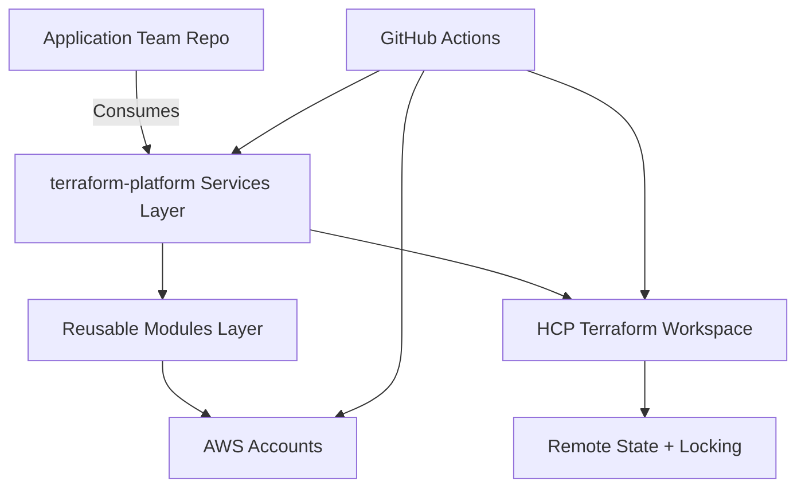

# Enterprise Terraform Platform (AWS + HCP Terraform + GitHub Actions)

Production-ready Terraform platform repository designed for enterprise teams.

## 1. Architecture Overview



## 2. Repository Structure

```text
terraform-platform/
├── modules/
│   ├── s3/
│   ├── ec2/
│   ├── vpc/
│   ├── security-group/
│   ├── iam/
│   ├── kms/
│   ├── route-table/
│   ├── subnet/
│   ├── eip/
│   ├── nat/
│   ├── igw/
│   ├── alb/
│   ├── autoscaling/
│   ├── rds/
│   ├── cloudwatch/
│   ├── sns/
│   ├── sqs/
│   └── secrets-manager/
├── services/
│   ├── network/
│   ├── compute/
│   ├── storage/
│   ├── security/
│   ├── data/
│   └── messaging/
├── examples/
│   └── project-a-infra/
│       ├── dev/
│       ├── qa/
│       └── prod/
├── .github/workflows/
├── versions.tf
├── providers.tf
├── backend.tf
├── variables.tf
├── outputs.tf
└── README.md
```

## 3. Design Principles

- Modules are independent and reusable.
- No hardcoded resource values or account-specific identifiers in modules.
- Services compose modules and pass only input values.
- Environment differences are controlled through tfvars and workspace variables.
- Security-first defaults (encryption, least privilege, private-first networking).

## 4. Module Standards

Each module contains only:

- main.tf
- variables.tf
- outputs.tf
- README.md

Each module does not contain:

- provider configuration
- backend configuration
- terraform.tfvars
- environment-specific values
- credentials or secrets

## 5. Services Layer

- services/network orchestrates VPC, subnet, route-table, nat, igw, eip.
- services/compute orchestrates ec2, security-group, iam, optional eip.
- services/storage orchestrates s3.
- services/security orchestrates kms and secrets-manager.
- services/data orchestrates rds.
- services/messaging orchestrates sns and sqs.

## 6. HCP Terraform Implementation Guide

1. Create HCP Terraform organization:
- Go to app.terraform.io and create org (for example: acme-platform).

2. Create workspaces:
- Workspace pattern: prj-<env>-<service>
- Examples: prj-dev-network, prj-qa-compute, prj-prod-storage.

3. Configure remote backend:
- Each service includes backend.tf using terraform cloud block.
- Set hcp_organization and hcp_workspace_name via workspace variables or tfvars.

4. Configure authentication:
- Set TF_TOKEN_app_terraform_io in CI/CD secret store.
- For local use: terraform login.

5. Configure workspace variables:
- Required: aws_region, environment, project_name, owner, cost_center.
- Optional: data_classification, additional_tags.
- Sensitive: DB passwords, secret_string, user_data, any credentials.

6. Configure AWS credentials securely:
- Prefer workload identity via GitHub OIDC and AWS AssumeRole.
- Avoid long-lived access keys.

7. Store Terraform state remotely:
- Automatic through terraform cloud backend in each service.

8. Enable state locking:
- Native in HCP Terraform remote state.

9. Manage multiple workspaces:
- One workspace per service per environment.
- Example matrix:
  - prj-dev-network
  - prj-dev-compute
  - prj-qa-network
  - prj-prod-storage

10. Recommended workspace naming convention:
- prj-<environment>-<service>
- Keep lowercase with hyphens.

11. Recommended folder structure:
- Platform repo contains reusable modules and service composition.
- App repo contains env folders with tfvars and minimal main.tf calling service module source.

12. Remote execution vs local execution:
- Remote execution: preferred for regulated enterprise pipelines and shared audit trails.
- Local execution: acceptable for rapid development only with strict identity controls.

13. HCP Terraform best practices:
- Use workspace variable sets for shared non-secret values.
- Use team-based RBAC and SSO.
- Enable run tasks/policy checks (Sentinel/OPA) for governance.
- Restrict production applies via approval workflows.

## 7. GitHub Actions

Workflows included:

- terraform-pr.yml: fmt/validate checks on pull requests.
- terraform-deploy-nonprod.yml: plan/apply for dev/qa/uat/staging.
- terraform-deploy-prod.yml: separate plan and apply jobs using production environment approvals.
- terraform-destroy.yml: manual-only destroy with typed confirmation gate.

### GitHub Recommendations

- Use branch protection on main:
  - Require pull request.
  - Require status checks from terraform-pr workflow.
  - Require code owner review.
  - Prevent force pushes.
- Use GitHub Environments:
  - dev, qa, uat, staging, production.
  - Require reviewers for production.
- Secrets:
  - TF_API_TOKEN
  - AWS_DEPLOY_ROLE_ARN
- Variables:
  - HCP_ORGANIZATION, AWS_REGION, PROJECT_NAME, OWNER, COST_CENTER, DATA_CLASSIFICATION

## 8. Module Usage Examples

S3 module direct usage:

```hcl
module "s3" {
  source            = "../../modules/s3"
  bucket_name       = "org-prod-audit-bucket"
  versioning_enabled = true
  enforce_tls       = true
  tags              = { Service = "storage" }
}
```

Service usage from another repository:

```hcl
module "network" {
  source = "git::https://github.com/your-org/terraform-platform.git//services/network?ref=v1.0.0"

  aws_region          = var.aws_region
  environment         = var.environment
  project_name        = var.project_name
  owner               = var.owner
  cost_center         = var.cost_center
  data_classification = var.data_classification
  service_name        = "network"
  hcp_organization    = var.hcp_organization
  hcp_workspace_name  = var.hcp_workspace_name
  additional_tags     = var.additional_tags

  vpc_name            = var.vpc_name
  vpc_cidr_block      = var.vpc_cidr_block
  public_subnets      = var.public_subnets
  private_subnets     = var.private_subnets
  tags                = var.tags
}
```

## 9. Adding a New Module

1. Create new folder under modules/<resource-name>.
2. Add main.tf, variables.tf, outputs.tf, README.md.
3. Ensure no backend/provider/tfvars in module.
4. Add validations and secure defaults.
5. Expose meaningful outputs only.
6. Add service wiring in services/<domain> if needed.

## 10. Creating a New Environment

1. Create workspace in HCP Terraform: prj-<env>-<service>.
2. Add environment folder in app repo.
3. Add main.tf calling service source at pinned git ref.
4. Add terraform.tfvars for environment values.
5. Configure environment-specific GitHub Environment approvals and secrets.

## 11. Creating a New Project

1. Create project repository (for example: project-b-infra).
2. Add env folders (dev/qa/prod) with minimal main.tf and terraform.tfvars.
3. Consume this platform via git module source pins.
4. Reuse the same services and modules without changing platform code.

## 12. Naming Conventions

- Resources: <project>-<environment>-<service>-<component>
- Workspaces: prj-<environment>-<service>
- Tags:
  - Environment
  - Project
  - Owner
  - CostCenter
  - DataClass
  - ManagedBy
  - Service

## 13. Variable Naming Standards

- snake_case for all variable names.
- Include type, description, and validation where relevant.
- Mark secrets as sensitive = true.
- Do not default sensitive credentials.

## 14. Security Recommendations

- Enforce encryption at rest (KMS where required).
- Enforce encryption in transit (TLS-only for S3).
- Block S3 public access by default.
- Restrict security groups to least privilege CIDRs and ports.
- Use IAM roles and least privilege policies.
- Avoid wildcard permissions unless justified and reviewed.
- Keep DB and app tiers in private subnets.
- Use Secrets Manager for sensitive application secrets.
- Never commit tfstate, secrets, or tfvars with secrets.

## 15. Troubleshooting Guide

- Error: module not installed
  - Run terraform init in the service folder.
- Error: backend/workspace mismatch
  - Confirm hcp_workspace_name and TF_WORKSPACE values match.
- Error: authentication failed to HCP
  - Verify TF_TOKEN_app_terraform_io secret/token.
- Error: AWS access denied
  - Verify IAM role trust policy for GitHub OIDC and required permissions.
- Error: provider variable missing
  - Ensure required TF_VAR_* values are set in workspace or workflow.

## 16. Best Practices Checklist

- Pin module source refs (use git tags).
- Run fmt, validate, and plan on every PR.
- Require approvals for production applies.
- Use policy-as-code checks for governance.
- Keep modules small, composable, and service-agnostic.
- Favor for_each and typed objects over duplicated resources.
- Expose only required outputs.
